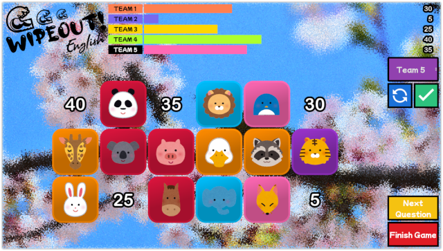

# Wipeout English (Game)
**An English learning board game made using Godot Engine in GDScript.**

[Click here](https://games.tetsuo-travis.com/) to play a working version.
**The game currently supports English and Japanese menus.**

### How to play
The live game on my website has a 'how to' button in the main menu.
Please load the game and click the button for a simple breakdown of the game.
English and Japanese is currently supported.

### About the game
This game is aimed at Japanese students learning English, but the base functionality can be used as a board game for any class or occasion (The gameplay functionality works independently).

The game has been created with the intention that the teacher controls the game, where students can select a block to flip.

The aim of the game is for a team to score the highest points without being wiped out (As of now the wipeout functionality resets all teams scores to 0).

### Why Godot
I strongly believe that education is something that should be free and open to all, it give more people the ability to learn and thus help society as a whole. This is why I chose to use Godot as the game engine as it is free and open source software (FOSS).

### Current functionality
- You can select the grade and questions are changed accordingly
- There's a difficulty slider that adjusts the chance of a wipeout appearing
- The team size can be from 1 to 18 teams (check settings)
- You can show/hide the team score (hidden by default)
- A random student selector is available by student number (it's possible to add a gap if boys/girls start at a different number)
- Select from a list of questions
- Set the theme for the blocks

### Plans for upgrades
##### Short Term
- ~~Adding more animations and sounds to the gameplay~~ (Added)
- ~~Settings section for more user friendly gameplay~~ (Added)
- ~~Adding mutiple questions sets per game~~ (Added)
- Randomly pick a block to flip (This only displays a random choice currently)
- Allow the possiblity of themes for background

##### Long Term
- Getting questions from an API
- Save states in web export

#### Editing/Running your own version
The game has currently only been exported as a web format so you can play it via [my website](https://games.tetsuo-travis.com/).
If you'd like to run the game locally or edit it yourself you would need to:
1. Install Godot 3.4+
2. Download the game files from GitHub
3. Unpack and import the game to Godot

### Credits
Images used in questions - [Irasutoya](www.irasutoya.com)

Game sounds:
- [Lokif](opengameart.org/users/lokif)
- [David McKee (Virix)](soundcloud.com/virix)
- [Luke.Rustltd](opengameart.com/users/lukerustltd)

### Contributions
If you'd like to contribute to the project please send me a message on GitHub!

I'm still relatively new to Godot and game development so any help would be much appreciated.